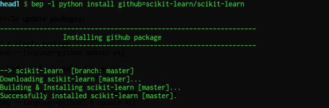
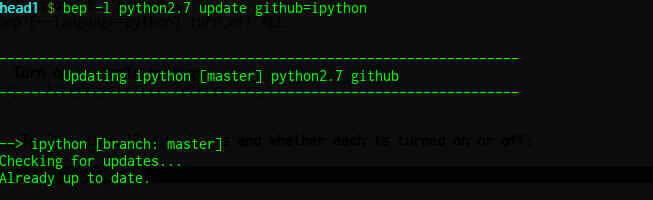
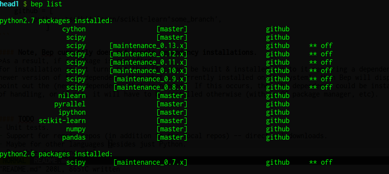

# Bep


## The gist of it...

Bep provides a simple way to allow running the absolute newest versions (bleeding edge versions) of any particular set of packages, it does not interfere with packages installed at the system level and it does not require root access for use; Bep also allows installing and running other versions of packages as well (other than just the bleeding edge versions).  To use, just specify at the command line a package for either installation, updating or removal; alternatively, several packages can be installed at the same time by just specifying the packages wanted for installation in a file named `.bep_packages` in your home directory; once done, then issue the simple installation command.

Additionally, several versions of the same package can be installed with Bep (bleeding edge versions and others), with all but one of those installed versions being the currently active version.  Meaning, there will only be one version seen by the path at any given time.  Therefore, Bep makes switching between different versions of the same package easy to do.  And if all versions of a package installed with Bep are hidden ("turned off"), then access to a version of that same package installed at the system level (from a package manager or the like) can be done without needing to remove the package installed with Bep.

###Bep makes life easier for two main reasons: 

1. 
It allows installing packages when you don't have root privileges on a shared filesystem; 

2. 
And since the packages installed with Bep are put into their own location (in user's home directory), Bep doesn't mess with anything installed at the system-level -- meaning, packages installed with Bep won't get mixed in with versions of packages installed system-wide.  This way the system-level packages are left alone (packages installed via package managers or the like) and the Bep packages are kept in their own isolated area.  (Note though, it is easy to switch back to a system-level installed version of a package by turning off or removing the package installed with Bep). 


## The basic commands are straightforward:

###To install packages: 

```
# A single package:
bep --language=python install pkg

# All packages specified in the .bep_packages file:
bep install


# NOTE, for package installs, the "pkg" above 
# should be specified like so:
# `pkg_type=repo_type+pkg_name^branch_name`
# 
# "pkg_type":  either github, gitorious, bitbucket, local_repo
# "repo_type":  either git, hg, bzr.
# "pkg_name":  either "user/package_name" from the pkg_type code hosting
#              site, or the path to the package on the local file system.
# "branch_name":  is optional & specifies if a specific branch should be
                  installed; if not specified, then master branch is installed.
# Eg. 
bep install github=git+ipython/ipython[^optional_branch]

```

For example:



####NOTE, for all other command operations, the "pkg" only needs to be specified like so:
```
# repo_type=package_name
#
# "repo_type":  the same as for installs
# "package_name":  just the name of the package.
#
# Eg.
bep [a command below] github=ipython
```

For example:



###To update packages: 

```
# A single package
bep --language=python update pkg
    
# Update all installed packages
bep update ALL

# Update all packages for a specific language
bep --language=python2.6 update ALL
```


###To remove packages: 
```
# Remove a single package
bep --language=python remove pkg

# Remove "turned off" packages -- either for a 
# specific language or all turned off packages
bep [--language=python] remove turned_off

```

###To turn on or off packages: 
```
# Turn off a single package
bep --language=python turn_off pkg 

# Turn off all packages
bep [--language=python] turn_off ALL 


# Turn on a single package
bep --language=python turn_on pkg
```

###To list installed packages and whether each is turned on or off:
```
# List installed packages
bep [--language=python] list
```




###And lastly, to see the exact command to update/remove/turn_on|off a specific installed package: 

    bep {update/remove/turn_on|off} pkg 

(for more details see `bep --help`.)


## A bit more info...

Basically what Bep does, is that it sets up an installation area in the user's home directory (under `.bep`) and downloads & installs all of the specified packages into this location.  And since this area is searched first on the user's path, the packages installed by Bep are called upon for use before the system-level packages.  Currently, all of these packages are simply version controlled repositories (git, mercurial & bazaar), which are cloned/downloaded, built and then installed behind the scenes by using the `bep` commands in the various ways outlined above.  All that really needs to be done is to specify where to get these repos from -- eg. github, gitorous, bitbucket, or repos located on the local filesystem.  By default, a package installed with Bep uses the master branch of its specified repository; however, if a specific branch (other than master) is wanted for installation, then this can easily be done instead.


### To install bep:

Bep relies only on the python standard library and supports python >= 2.7.

If you want to install Bep system-wide:

`python setup.py install`

Alternatively, if you don't have root access and just want to install Bep locally under your user:

`python setup.py install --user`

If this later route is taken, then Bep is installed in the user's home directory and 
you will need to add the location of Bep to your PATH as follows:

( the following info can likely be narrowed down by executing:
`python -c "import site; print site.getuserbase()"` )

#### For *nix's:
Add this to your `.bashrc`/`.zshrc`:

`export PATH=$HOME/.local/bin:$PATH`

#### For Mac:
Either add the same thing as used by *nix's above, or if that doesn't work, then add something like this in your `.bashrc`/`.zshrc`:

`export PATH=$HOME/Library/Python/[2.X or 3.X]/bin:$PATH`
    
#### For Windows:
Bep is untested, but it should work -- you'd have to add the analogous thing to whatever is the equivalent of a shell config file (eg. would have to add to your path the area where executable stuff gets installed at the "user" level with python)
    
suggested as per [PEP370](http://www.python.org/dev/peps/pep-0370/) -- particularly see the "user script directory"  section:

`%APPDATA%/Python/Scripts`


### An example of a sample `.bep_packages` file would look like:

```python
#! /usr/bin/env python
packages = dict(
    github = [
        ### eg:
        # 'language-->username/projectname', 
        'python-->scikit-learn/scikit-learn',
            ],

    gitorious = [
        ### eg:
        # 'language-->username/projectname', 
                ],

    bitbucket = [
        ### need to specify what type of repo it is 
        ### (since it could be either git or mercurial):
        # 'language-->repo_type+username/projectname', 
        #'python-->hg+username/projectname',
        #'python-->git+username/projectname',
                ],

    local_repo = [
        ### again, need to specify what type of repo 
        ### it is (could be git, mercurial or bazaar):
        # 'language-->repo_type+/a_dir/on_local_filesystem/repo_name', 
        #'python-->git+/home/username/some_dir/some_git_repo',
        #'python-->hg+/home/username/some_other_dir/some_mercurial_repo',
        #'python-->bzr+/home/username/another_dir/some_bazaar_repo',
                ],
)
```

#### To install a specific branch
>Just specify the branch name 
appended to the package name with a `^`.  For example, you'd specify something like the 
following instead of the above listing: 
```
    github = [
        'python-->scikit-learn/scikit-learn^some_branch',
            ]
```

#### Note, Bep currently does not handle dependency installations.  
>As a result, if a package is specified
for installation and it turns out that it cannot be built & installed due to it requiring a dependency not being installed on the system (or perhaps needing a newer version of that dependency than what is currently installed on the system), then Bep will display the installation error that occurs, which will likely point out the (newer) dependency that is needed.  If this occurs, then the dependency could be installed with Bep as well, if it's something that Bep is capable of handling, or if not, it will have to be installed otherwise (with an OS package manager, etc).


#### TODO
- Unit tests.
- Support for remote repos (in addition to the local repos) -- direct url downloads.
- Maybe for other languages besides just Python.
- Possible dependancy help...
