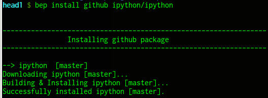
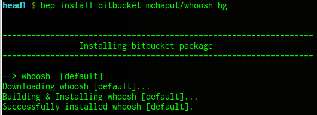
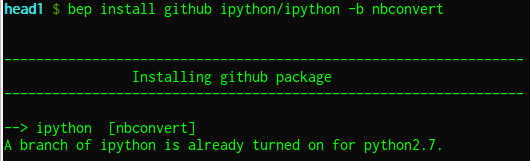
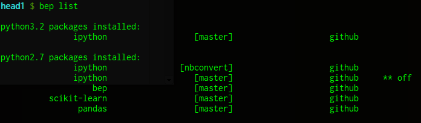

# Bep


## Table of Contents
* **[The Big Picture](#the-big-picture)**
* **[The Basic Commands](#the-basic-commands)**
  * [To Install Packages](#to-install-packages)
  * [All Other Commands](#all-other-commands)
  * [To Update Packages](to-update-packages)
  * [To Remove Packages](to-remove-packages)
  * [To Turn On & Off Packages](to-turn-on-&-off-packages)
  * [To List Installed Packages](to-list-installed-packages)
* **[To Install Bep](to-install-bep)**


## The Big Picture:
### The gist of it...

Bep provides a simple way to allow running &/or testing the absolute newest versions (bleeding edge versions) of any particular set of packages, it does not interfere with packages installed at the system level and it does not require root access for use.  To use, simply specify at the command line a package for either installation, updating or removal.  Alternatively, several packages can be installed at the same time by just specifying them in a `.bep_packages` file under the user's home directory; once done, then simply issue the installation command.

Moreover, several versions/branches of the same package can be installed with Bep, with all but one of those installed versions being the currently active ("turned on") version.  Meaning, there will only be one version seen by the environment at any given time.  Thus, Bep makes switching between different versions of the same package easy to do.  And if all versions of a package installed with Bep are hidden from the environment ("turned off"), then access to a version of that same package installed at the system level (from a package manager or the like) can be achieved without needing to fully remove the package.

### Bep is useful for a couple key reasons: 

1. Since the packages installed with Bep are put into their own location (in the user's home dir), Bep doesn't mess with anything installed at the system-level -- meaning, packages installed with Bep won't get mixed in with versions of packages installed system-wide from package managers or such.  (Note, it is easy to switch back to a system-level installed version of a package by turning off or removing the package installed with Bep);

2.  As briefly explained, Bep lets you install several branches of the same package side by side and allows you to easily switch between them.


### Just a bit of the implementation details...

What Bep does, is that it downloads & builds packages in `.bep` in user's home directory and then installs them into `.local`.  This area is searched first on the user's path, thus the packages installed by Bep are called upon for use before the system-level packages.  Currently, all of these packages are simply version controlled repositories (git, mercurial &/or bazaar), which are cloned, built and then installed behind the scenes by using the commands outlined below.  Just specify where to get these packages from -- supported are, github, gitorious, bitbucket, or repos located on the local file system.  By default, a package installed with Bep uses the development branch (master/default) of its specified repository; however, if a different branch is wanted for installation, then this can easily be done instead.


## The Basic Commands:

(Note, for all commands, specify the language arg if wanting to process a package under a language version other than the system default)

### To install packages: 

```
# A single package:
bep [--language=python_version] install pkg_type pkg_name [repo_type] [-b branch_name]

# All packages specified in the .bep_packages file:
bep install packages


# NOTE, for package installs, the above should be specified like so:
# 
# "pkg_type":	    either github, gitorious, bitbucket, local
# "pkg_name":   	either "user/package_name" from the pkg_type code hosting
#               	site, or the path to the package on the local file system.
# "repo_type":	    either git, hg, bzr (specify only if it comes from an 
		            ambiguous pkg_type -- github would only be git, but 
                	bitbucket could be either git or hg)
# "branch_name":    is optional & specifies if a specific branch should be
                    installed; if not specified, then master/default is installed.
		            And for local packages, it just uses the currently checked
		            out branch for the repo.
```
For example:



For bitbucket, repo_type would need to be specified:



And to install a specific branch:



As you can see, in order to install another branch of ipython under the same version of python, the branch of ipython that was just installed previously needs to be turned off first.  After doing so, then we can proceed with installing the other branch of ipython:


Note though, we can install a version of ipython under a different version of python without needing to turn off anything because this will be the first branch of ipython installed under this other version of python: 


### All Other Commands: 
#### There are 2 ways to specify the commands -- the full syntax way and a shorter way.  The shorter way only requires that an already installed "pkg_name" is specified, which then shows the full syntax for a command, and allows you to run the command, done like so:
```
# bep {update, remove, turn_on, turn_off} pkg_name
```

#### But first, here are some examples of the full syntax:
For example:


#### To Update Packages:
```
# A single package:
bep [-l python_version] update pkg_name -b branch_name
    
# Update all installed packages:
bep update --all
```


### To Remove Packages: 
```
# Remove a single package:
bep [-l python_version] remove pkg_name -b branch_name

# Remove all installed packages:
bep remove --all

```

### To Turn On & Off Packages: 
```
# Turn off a single package:
bep [-l python_version] turn_off pkg_name -b branch_name

# Turn off all packages:
bep turn_off --all 


# Turn on a single package:
bep [-l python_version] turn_on pkg_name -b branch_name
```

### As mentioned, all of these commands also accept just a pkg_name as a single argument, which allows you to see and run the full command (for update, remove, turn_on|off): 
```
bep {update, remove, turn_on, turn_off} pkg_name 
```

For example:


### To List Installed Packages:
#### (and whether each is turned on or off)
```
# List installed packages:
bep list
```




(for more details see `bep --help`.)


## To Install Bep:

Bep relies only on the python standard library and supports python >= 2.7.  

#### Just clone/download Bep to wherever you want (it doesn't matter) and then... 

If you want to install Bep system-wide (**NOT the recommended way**, as likely requires root access):

`python setup.py install`

Alternatively, if you don't have root access and/or just want to install Bep locally under your user (**the RECOMMENDED WAY**):

`python setup.py install --user`

If this later route is taken, then Bep is installed in the user's home directory and 
you will need to add the location of Bep to your PATH as follows:

( the following info can likely be narrowed down by executing:
`python -c "import site; print site.getuserbase()"` )

#### For *nix's:
Add something like this to your `.bashrc`/`.zshrc`:

`export PATH=$HOME/.local/bin:$PATH`

#### For Mac:
Either add the same thing as used by *nix's above, or if that doesn't work, then add something like this in your `.bashrc`/`.zshrc`:

`export PATH=$HOME/Library/Python/[2.X or 3.X]/bin:$PATH`
    
#### For Windows:
Bep is untested, but it should work -- you'd have to add the analogous thing to whatever is the equivalent of a shell profile/config file (eg. would have to add to your path the area where executable stuff gets installed at the "user" level with python)
    
as suggested per [PEP370](http://www.python.org/dev/peps/pep-0370/) -- particularly see the "user script directory" section; which is possibly:

`%APPDATA%/Python/Scripts`


### Also...Bep can manage Bep!
Once Bep is installed, it can re-install itself to handle updates to itself:

`bep install github b-e-p/bep`

In the same vein, if Bep was initially installed at the user level (not systemwide), then **Bep can uninstall itself**:

`bep remove github bep -b master`

Likewise, again if Bep was installed at the user level, then **to remove everything Bep installed, including Bep itself**:

`bep remove --all`


### Example of a sample `.bep_packages` file:

```python
#! /usr/bin/env python 
#
# You don't actually need this part at the top, it just provides 
# for syntax highlighting as this is just a plain old python file.

# Any of these can be specified like so, where
# language & branch are optional, and repo_type only
# needs to be specified if it comes from an ambiguous
# source (eg. Bitbucket could be either git or hg):
#
# [language-->]repo_type+userName/repoName[^branch]
# eg. hg+mchaput/whoosh                 # under bitbucket
# eg. python3-->ipython/ipython       # under github
# eg. pydata/pandas                     # under github 

packages = dict(
    github = [
        #### 'username/projectname' is all that's required:
        'pydata/pandas',
        #### but could give the full info if wanted:
        'python-->git+scikit-learn/scikit-learn',
        #### or specify a lang other than default:
        'python3-->ipython/ipython',
        #### or specify a branch other than master:
        'ipython/ipython^nbconvert',
            ],


    gitorious = [
        #### same formating as github:
        'python-omega/python-omega'
                ],


    bitbucket = [
        #### repo_type is required and other options are again optional:
        #'git+userName/repoName',
        'hg+mchaput/whoosh',
                ],


    local = [
        #### again, need to say what type of repo it is, and also,
        #### don't specify a branch; when installed it uses the
        #### currently checked out branch from the local repo:
        #### 'repo_type+/a_dir/inside_a_dir/on_local_machine/pkg_name', 
        ####'hg+/home/your_username/some/dir/some_mercurial_repo',
        ####'git+/home/username/some/other/dir/some_git_repo',
        ####'bzr+/home/username/another/dir/some_bazaar_repo',
        'git+/home/jgors/Documents/repos/ipython',
                ],
)
```


#### Note, packages installed with Bep might not install or work due to dependency issues.  
>As a result, if a package is specified
for installation and it turns out that it cannot be built & installed due to it requiring a dependency not being installed on the system (or perhaps needing a newer version of the dependency than what is currently installed on the system), then Bep will(/tries to) display the installation error that occurs, which will likely point out the (newer) dependency that is needed.  If this occurs, then the dependency could be installed with Bep as well, if it's something that Bep is capable of handling, or if not, it will have to be installed otherwise (with an OS package manager, pip, etc).


#### TODO
- Unit tests.
- Support for remote repos (in addition to the local repos).
- Could support other languages besides just Python, but I'm not going to do it. 
- Maybe latest "stable" packages?
