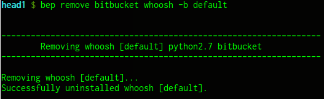
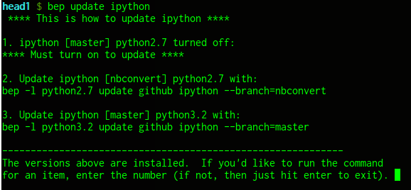

# Bep

[](https://travis-ci.org/b-e-p/bep) travis-ci.org (master branch)


-----

#### tl;dr
Bep provides a very simple way to install, update and run the absolute newest versions (bleeding edge development versions) of any particular set of Python packages.

-----

## Table of Contents
* **[The Big Picture](#the-big-picture)**
* **[The Basic Commands](#the-basic-commands)**
  * [To Install Packages](#to-install-packages)
  * [All Other Commands](#all-other-commands)
    * [To Update Packages](#to-update-packages)
    * [To Remove Packages](#to-remove-packages)
    * [To Turn On and Off Packages](#to-turn-on-and-off-packages)
    * [To List Installed Packages](#to-list-installed-packages)
* **[A bit of implementation details](#a-bit-of-implementation-details)**
* **[Installing Bep](#installing-bep)**
* **[Removing Bep](#also-bep-can-manage-bep)**
* **[Example of a Sample .bep_packages file](#example-of-a-sample-bep_packages-file)**

-----

## The Big Picture

#### Bep is useful for a couple key reasons:

1. Packages installed with Bep are installed in the default user installation area (under the user's home directory or if you have the `PYTHONUSERBASE` environment variable set, then wherever that is defined to be), and thus Bep doesn't mess with anything installed at the system-level.  Meaning, the packages installed with Bep don't get mixed in with stable release versions of packages that were installed from package managers.

2. Bep lets you install several versions/branches of the same package side-by-side and allows you to easily switch between them.


### The gist of it...

To use, simply specify at the command line a package for either installation, updating or removal.  Additionally, several packages can be installed at once by just specifying them in a `.bep_packages` file under the user's home directory and then issuing the install command.

As mentioned, several versions/branches of the same package can be installed alongside one another with Bep, with all but one of those installed versions being the currently active ("turned on") version.  Meaning, there will only be one version of a specific package seen by the environment at any given time.  Thus, Bep makes switching between different versions/branches of the same package very easy.  Also, if all versions of the same package that were installed with Bep are "turned off" (i.e. hidden from the environment), then access to a version of that same package installed at the system level (from a package manager) can be achieved without needing to fully remove any of the packages installed with Bep -- this can save large amounts of time when a given package has a long build/install time.


## The Basic Commands

(Note, for all commands, specify the `--language` arg only if wanting to process a package under a language version other than the system default)

### To install packages:

```
# 1. A single package:
bep [--language=python_version] install pkg_type pkg_name [repo_type] [-b branch_name]

# or
# 2. all packages specified in the .bep_packages file (see below for package file details):
bep install packages


# NOTE, for package installs, the above parameters should be specified like so:
#
# "pkg_type":     either github, bitbucket, local
# "pkg_name":     either "username/package_name" from the pkg_type code hosting
#                   site, or simply the path to the package on the local file system.
# "repo_type":    either git, hg, bzr (specify only if it comes from an
                    ambiguous pkg_type -- github would only be git, but
                    bitbucket could be either git or hg)
# "branch_name":  optional & specifies if a specific branch should be
                    installed; if not specified, then master/default is installed.
                    Note, for local packages, it just uses the currently checked
                    out branch for the local repo.
```
A quick example:


For bitbucket, repo_type would need to be specified:


And to install a specific branch:


As you can see, in order to install another branch of ipython under the same version of python, the branch of ipython that was just installed previously needs to be turned off first.  After doing so, then we can proceed with installing this other branch of ipython:


As mentioned, we can install a version of ipython under a different version of python without needing to turn off anything first because this would be the first branch of ipython installed under this other version of python:


## All Other Commands
##### There are 2 ways to specify the other commands -- the full syntax way (as was seen in the `turn_off` example above) and a shorthand interactive way.  The shorter way only requires the command and an already installed "pkg_name" to be specified.  Bep then shows the full syntax for the command, and allows you to choose whether to run the command.  Like so:
```
# bep {update, remove, turn_on, turn_off} pkg_name
```

### First, here are some examples of the full syntax way:
For example:





#### To Update Packages:
```
# A single package:
bep [-l python_version] update pkg_name -b branch_name

# Update all installed packages:
bep update --all
```


#### To Remove Packages:
```
# Remove a single package:
bep [-l python_version] remove pkg_name -b branch_name

# Remove all installed packages:
bep remove --all

```

#### To Turn On and Off Packages:
```
# Turn off a single package:
bep [-l python_version] turn_off pkg_name -b branch_name

# Turn off all packages:
bep turn_off --all


# Turn on a single package:
bep [-l python_version] turn_on pkg_name -b branch_name
```

### Now the shorter way:
##### Remember, all of the commands also accept just the pkg_name as a single argument, which allows you to see and run the full command (for update, remove, turn_on | off):
```
bep {update, remove, turn_on, turn_off} pkg_name
```

For example:




#### To List Installed Packages:
##### (shows whether each package is turned on or off)
```
# List installed packages:
bep list
```


##### (for more details on any of the commands see `bep --help`.)


## A bit of implementation details...

What Bep does is it downloads & builds the packages in `.bep` in the user's home directory and then installs them into `.local` (or as mentioned above, if you have the `PYTHONUSERBASE` environment variable set, then wherever that is defined to be).  This area is searched first on the python path, thus the packages installed by Bep are called upon for use before the system-level packages.  Currently, all of these packages are simply version controlled repositories (git, mercurial &/or bazaar), which are cloned, built/complied and then installed behind the scenes by using the commands outlined above.  Just specify where to get these packages from -- github, bitbucket, or repos on the local file-system.  By default, a package installed with Bep uses the development branch (master/default) of its specified repository; however, if a different branch is wanted for installation, then that can easily be done instead.


## Installing Bep

Bep relies only on the python standard library and supports python >= 2.7.

#### You can install bep with pip, like this:

`pip install bep --user`

#### Alternatively, you can clone Bep to wherever you want, go to the root of that directory and then install with:

If you want to install Bep system-wide (**NOT recommended**, as likely requires root access):

`python setup.py install`

Or if you don't have root access and/or just want to install Bep locally under your user (**the better way**):

`python setup.py install --user`

#### Note, if `--user` is specified, then Bep gets installed in the user's home directory and you will likely need to add the location of Bep to your PATH as follows:

(the following info can likely be narrowed down by executing:
`python -c "import site; print site.getuserbase()"`)

#### For *nix's:
Add something like this to your `.bashrc`/`.zshrc`:

`export PATH=$HOME/.local/bin:$PATH`

#### For Mac:
Either add the same thing as used by *nix's above, or if that doesn't work, then add something like this in your `.bashrc`/`.zshrc`:

`export PATH=$HOME/Library/Python/[2.X or 3.X]/bin:$PATH`

#### For Windows:
Bep is untested, but it should work -- you'd have to add the analogous thing to whatever is the equivalent of a shell profile/config file (eg. would have to add to your path the area where executable stuff gets installed at the "user" level with python)

as suggested per [PEP370](http://www.python.org/dev/peps/pep-0370/) -- particularly see the "user script directory" section; which is possibly:

`%APPDATA%/Python/Scripts`


### Also, Bep can manage Bep
Once Bep is installed, it can re-install itself to handle updates to itself:

`bep install github b-e-p/bep`

Similiarly, if Bep was installed at the user level (not systemwide), then **Bep can uninstall itself**:

`bep remove github bep -b master`

Likewise, if Bep was installed at the user level, then **to remove everything that Bep installed, including Bep itself**:

`bep remove --all`

Or **if bep was installed with pip**, then simply:

```
bep remove --all    # to remove all pkgs installed with bep
pip uninstall bep   # to remove bep itself
```


### Example of a Sample .bep_packages file

```python
#! /usr/bin/env python
#
# You don't actually need that part at the top, it just provides
# for syntax highlighting as this is just a plain python file.

# Any of the following can be specified like so, where
# language & branch are optional, and repo_type only
# needs to be specified if it comes from an ambiguous
# source (eg. Bitbucket could be either git or hg):
#
# [language-->]repo_type+userName/repoName[^branch]
# eg. hg+mchaput/whoosh                 # for bitbucket
# eg. pydata/pandas                     # for github
# eg. python3-->ipython/ipython         # for github

packages = dict(
    github = [
        #### 'username/projectname' is all that's required:
        'pydata/pandas',

        #### but could specify a lang other than the default:
        'python3-->ipython/ipython',

        #### or specify a branch other than master:
        'ipython/ipython^nbconvert',

        #### or both:
        'python3-->ipython/ipython^nbconvert',
            ],


    bitbucket = [
        #### repo_type is required (git or hg) and other options are again optional:
        'git+userName/repoName',
        'hg+userName/repoName',
        # etc, similiar to github specifications above
                ],


    local = [
        #### again, need to say what type of repo it is; also,
        #### don't specify a branch -- when installed it uses the
        #### currently checked out branch from the local repo:
        #### 'repoType+/some_dir/inside_a_dir/on_local_machine/pkg_name',
        ####'hg+/home/username/some_dir/a_mercurial_repo',
        ####'git+/home/username/some_other_dir/a_git_repo',
        ####'bzr+/another_dir/a_bazaar_repo',
        'git+/home/jgors/repos/ipython',
        'hg+/tmp/cool_mercurial_repo',
            ],
)
```


#### Note, Bep doesn't handle dependencies for packages installed with Bep, so an install might not work due to dependency issues.
>As a result, if a package is specified for installation and it turns out that it cannot be built & installed due to it requiring a dependency not being available on the system (or perhaps needing a newer version of the dependency than what is currently installed on the system), then Bep displays the installation error that occurs, which will likely point out the dependency that is needed.  If this occurs, then the dependency could be installed with Bep as well (if it's something that Bep is capable of handling) or if not, it will have to be installed with an OS package manager, pip, etc.


### TODO
- Always more comprehensive unit-tests.
- Support for remote repos (in addition to the already supported local repos).
